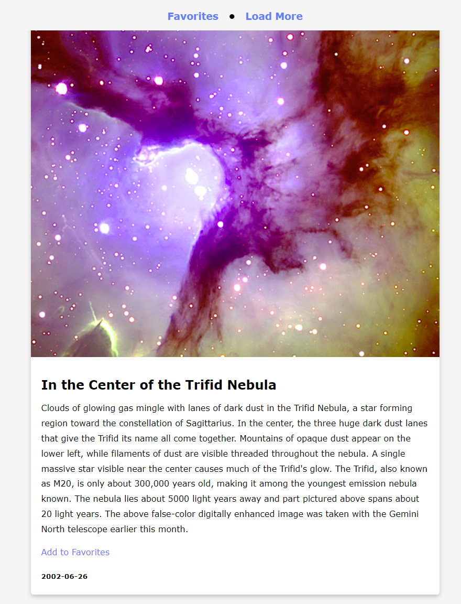

[nasa-apod-url]: https://amssdias.github.io/nasa-apod/

# NASA Astronomy Picture of the Day

    

NASA Astronomy Picture of the Day is a web application that leverages NASA's API to fetch and display daily astronomy pictures along with their descriptions. Users can save their favorite pictures to local storage in their browser for later viewing and remove them if they wish.

## Features
- Fetches and displays the Astronomy Picture of the Day (APOD) using NASA's API.
- Allows users to save favorite pictures to local storage.
- Provides functionality to remove saved pictures from favorites.
- Simple and intuitive user interface.

## Live Demo

You can see the website in your browser by following this link: [NASA API Pictures][nasa-apod-url]

